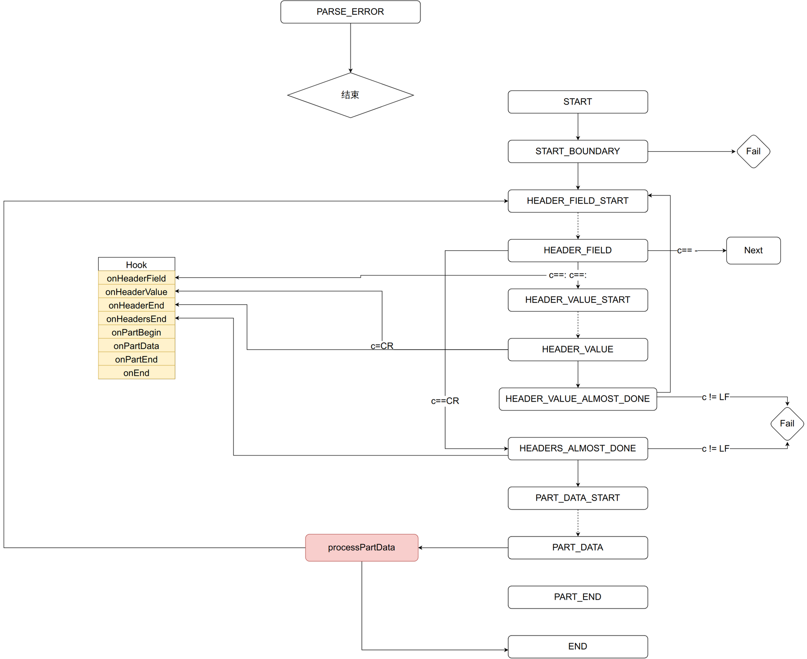

怎么解析multipart

## 涉及到的文件

connection::parse_multipart

multipart_reader.hpp
multipart_parser.hpp

## 如果理解multipart 的上传格式

```
------FormBoundaryShouldDifferAtRuntime 
Content-Disposition: form-data; name="ranboy"

lvx
------FormBoundaryShouldDifferAtRuntime
Content-Disposition: form-data; name="file"; filename="keyboard-sliper.jpg"
Content-Type: image/jpeg

xxxxxxxx
------FormBoundaryShouldDifferAtRuntime--
```
[post 提交之 multipart/form-data; boundary= ... - 柳帅 - 博客园](https://www.cnblogs.com/angle6-liu/p/11724850.html)


```
        Callback onHeaderField;     ///头的值
        Callback onHeaderValue;     ///头的值
        Callback onHeaderEnd;       ///头的结

        Callback onHeadersEnd;      ///所有头的结束

        Callback onPartBegin;       ///部分中的开始
        Callback onPartData;        ///部分中的数据
        Callback onPartEnd;         ///部分结束

        Callback onEnd;             ///全部结束
```

解析图


如果有多个header是如何状态是如何转移的呢?
