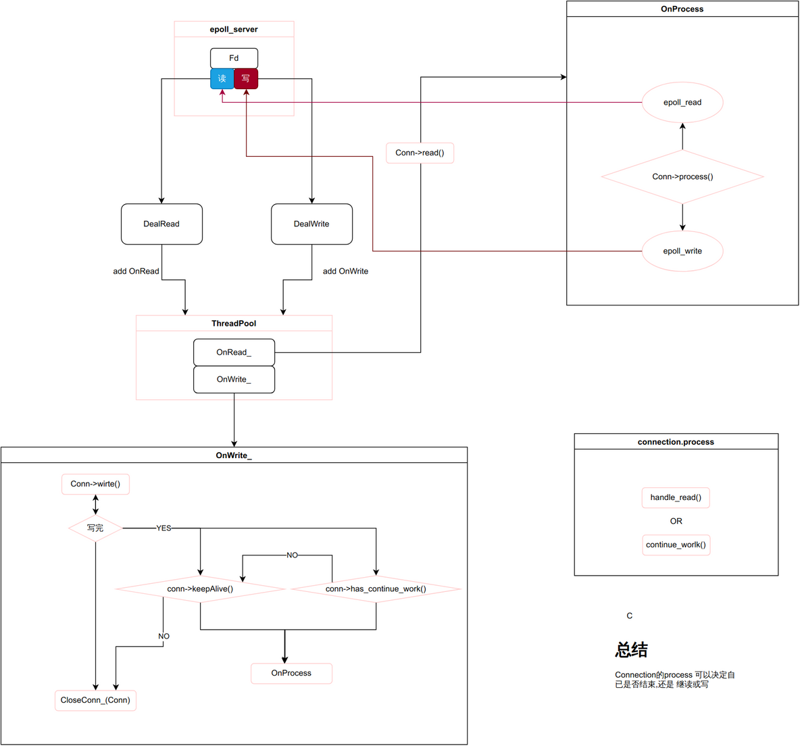
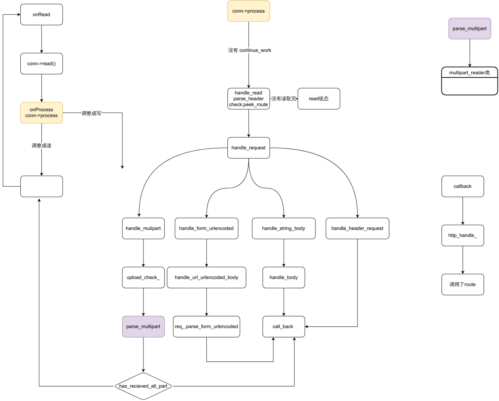
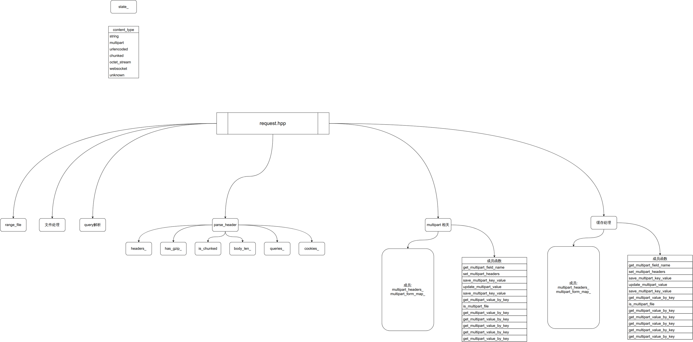

## 说明

这里写了这个服务器的文档，包括

 - 原理
 - 如何使用

## 总体框架

http_server对于每一个请求都产生一个`connection`,所以你可能想知道connection是如何动作的.

### connection的读写转换

connection里包含读取写的功能,那什么时候读取,什么时候写(发送信息)呢.看下面的图来理解**读写转换机制**

connection里的process会在读取完信息后时行任务拆分

connection的主要作用其时就是分析来的信息,主要使用的就是request.hpp类

## 类的关系

[类关系图](./类关系图.md)

## 其它功能类

- [log类](./类/log.md)
- [request类](./类/request.md)
- [response类](./类/response.md)
- [http_cache类](./类/http_cache.md)
- [route类](./类/route.md)
- [cookie类](./cookie.md)

