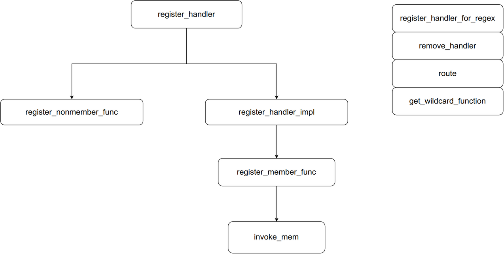

类的位置[core/http_router.hpp](core/http_router.hpp)

http_router是一个容器类

具体的注释看代码

- 注册路由 
 - `register_handler`
 - `register_handler_for_regex`
 - 底层`register_nonmember_func`
- 删除路由
- 执行路由
 - route
 - 把ap绑定到 invoke上
 - do_ap_before
 - Funtion route
 - do_void_after
 - do_after

底层容器有3种:
- 完全匹配型
- 模糊匹配型
- 正则匹配型

### register_handler

可以注册函数或成员函数到路由容器里

